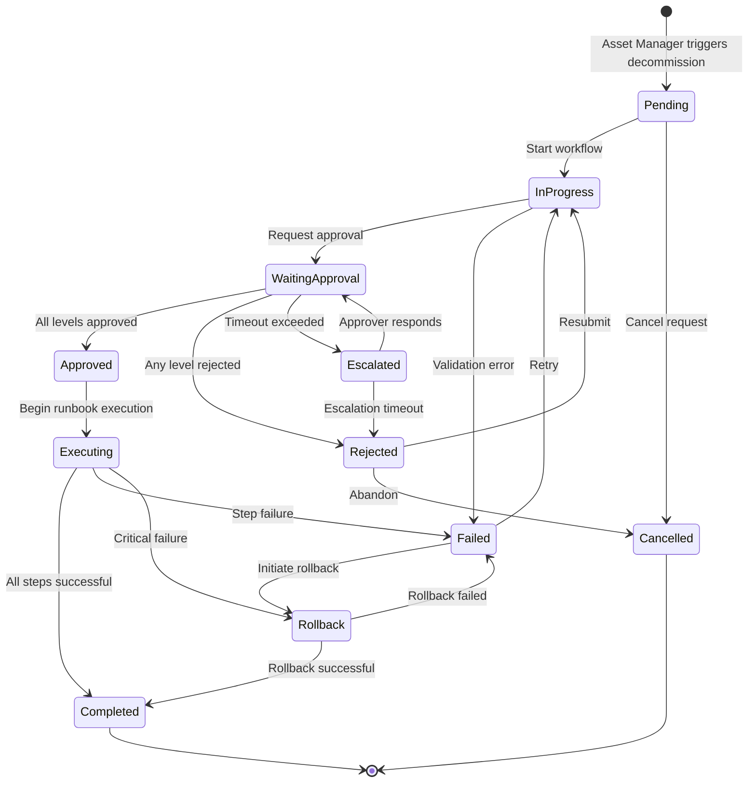
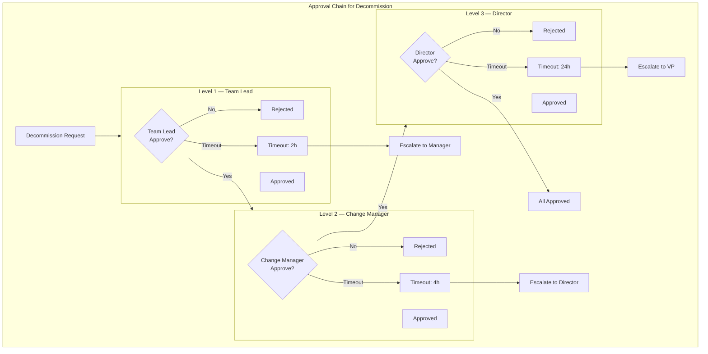
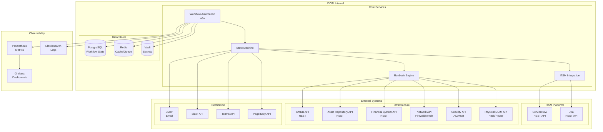

# Server Decommissioning Workflow — Architecture Diagram

> **Purpose:** Architecture diagram komprehensif untuk Server Decommissioning Workflow Automation berbasis n8n.
> **Scope:** End-to-end flow dari trigger hingga completion, termasuk approval, runbook, ITSM, dan monitoring.
> **Platform:** n8n workflow automation
> **Sources:** Block 8 Reference Design, FIT041 UC2, DCIM-Wiki Use Case Analysis

---

## Architecture Overview

```mermaid
flowchart TB
    %% ============================================================
    %% COLOR DEFINITIONS
    %% ============================================================
    classDef trigger fill:#1565C0,stroke:#0D47A1,color:#fff,stroke-width:2px
    classDef workflow fill:#2E7D32,stroke:#1B5E20,color:#fff,stroke-width:2px
    classDef approval fill:#E65100,stroke:#BF360C,color:#fff,stroke-width:2px
    classDef runbook fill:#6A1B9A,stroke:#4A148C,color:#fff,stroke-width:2px
    classDef itsm fill:#00838F,stroke:#006064,color:#fff,stroke-width:2px
    classDef external fill:#455A64,stroke:#263238,color:#fff,stroke-width:2px
    classDef notification fill:#AD1457,stroke:#880E4F,color:#fff,stroke-width:2px
    classDef escalation fill:#F57F17,stroke:#E65100,color:#fff,stroke-width:2px
    classDef error fill:#C62828,stroke:#B71C1C,color:#fff,stroke-width:2px
    classDef monitoring fill:#283593,stroke:#1A237E,color:#fff,stroke-width:2px
    classDef decision fill:#FF6F00,stroke:#E65100,color:#fff,stroke-width:2px

    %% ============================================================
    %% TRIGGER LAYER
    %% ============================================================
    subgraph TRIGGER["🎯 TRIGGER LAYER"]
        direction LR
        AM[Asset Manager<br/>Dashboard] -->|Manual Trigger| WEBHOOK[n8n Webhook<br/>POST /webhook/decommission]
        CMDB_EVENT[CMDB Status Update<br/>Status: Scheduled for Decommission] -->|Event| WEBHOOK
        WEBHOOK --> VALIDATE{Validate<br/>Asset exists?}
    end

    %% ============================================================
    %% WORKFLOW ORCHESTRATION
    %% ============================================================
    subgraph WORKFLOW["⚙️ WORKFLOW ORCHESTRATION (n8n)"]
        direction TB
        STATE_MACHINE[Workflow State Machine<br/>━━━━━━━━━━━━━━━━━━<br/>Pending → In Progress<br/>→ Waiting Approval<br/>→ Approved → Executing<br/>→ Completed / Failed / Rollback]
        
        subgraph N8N_NODES["n8n Workflow Nodes"]
            direction LR
            N1[Webhook Trigger<br/>Receive decommission request]
            N2[Validate Input<br/>Check asset_id, requester]
            N3[Create Workflow<br/>Generate workflow_id]
            N4[State: Pending]
        end
        
        N1 --> N2 --> N3 --> N4
    end

    %% ============================================================
    %% APPROVAL CHAIN
    %% ============================================================
    subgraph APPROVAL["✅ APPROVAL CHAIN (UC8 — Multi-Level)"]
        direction TB
        APPROVAL_START[Request Approval<br/>━━━━━━━━━━━━━━━━━━<br/>Decommission requires<br/>multi-level approval]
        
        subgraph LEVEL1["Level 1 — Team Lead"]
            L1_APPROVE{Team Lead<br/>Approve?}
            L1_TIMEOUT[Timeout: 2h<br/>Escalate to Manager]
        end
        
        subgraph LEVEL2["Level 2 — Change Manager"]
            L2_APPROVE{Change Manager<br/>Approve?}
            L2_TIMEOUT[Timeout: 4h<br/>Escalate to Director]
        end
        
        subgraph LEVEL3["Level 3 — Director"]
            L3_APPROVE{Director<br/>Approve?}
            L3_TIMEOUT[Timeout: 24h<br/>Escalate to VP]
        end
        
        APPROVAL_START --> L1_APPROVE
        L1_APPROVE -->|Approved| L2_APPROVE
        L1_APPROVE -->|Rejected| REJECT_REASONS[Rejection Handler<br/>━━━━━━━━━━━━━━━━━━<br/>• Log reason<br/>• Notify requester<br/>• Update ITSM ticket<br/>• Close workflow]
        L1_APPROVE -->|Timeout| L1_TIMEOUT
        L2_APPROVE -->|Approved| L3_APPROVE
        L2_APPROVE -->|Rejected| REJECT_REASONS
        L2_APPROVE -->|Timeout| L2_TIMEOUT
        L3_APPROVE -->|Approved| APPROVED_STATE[State: Approved<br/>Ready for Execution]
        L3_APPROVE -->|Rejected| REJECT_REASONS
        L3_APPROVE -->|Timeout| L3_TIMEOUT
    end

    %% ============================================================
    %% RUNBOOK EXECUTION
    %% ============================================================
    subgraph RUNBOOK["📋 RUNBOOK EXECUTION (UC13 — Decommission Runbook)"]
        direction TB
        EXEC_START[Execute Runbook<br/>━━━━━━━━━━━━━━━━━━<br/>State: Executing<br/>Start decommission steps]
        
        subgraph STEP1["Step 1: Pre-flight Validation"]
            S1_CHECK{Validate<br/>Dependencies?}
            S1_CMDB[Query CMDB<br/>Check CI relationships]
            S1_DEPENDENCY[Check Dependent CIs<br/>━━━━━━━━━━━━━━━━━━<br/>• Child servers<br/>• Network connections<br/>• Storage volumes<br/>• Service dependencies]
        end
        
        subgraph STEP2["Step 2: Network Cleanup"]
            S2_FIREWALL[Remove Firewall Rules<br/>━━━━━━━━━━━━━━━━━━<br/>• Source IP<br/>• Destination IP<br/>• Service ports]
            S2_VLAN[Remove VLAN Config<br/>━━━━━━━━━━━━━━━━━━<br/>• Switch port<br/>• VLAN assignment<br/>• Trunk config]
            S2_DNS[Remove DNS Records<br/>━━━━━━━━━━━━━━━━━━<br/>• A record<br/>• PTR record<br/>• CNAME]
        end
        
        subgraph STEP3["Step 3: Security Cleanup"]
            S3_AD[Remove AD Groups<br/>━━━━━━━━━━━━━━━━━━<br/>• Server admin group<br/>• Service accounts<br/>• Group memberships]
            S3_CERT[Revoke Certificates<br/>━━━━━━━━━━━━━━━━━━<br/>• SSL/TLS certs<br/>• Client certs<br/>• Code signing certs]
            S3_SECRETS[Rotate/Remove Secrets<br/>━━━━━━━━━━━━━━━━━━<br/>• API keys<br/>• Database credentials<br/>• Encryption keys]
        end
        
        subgraph STEP4["Step 4: CMDB Update"]
            S4_STATUS[Update CI Status<br/>━━━━━━━━━━━━━━━━━━<br/>status: "Retired"<br/>decommission_date: now]
            S4_RELATIONSHIPS[Update Relationships<br/>━━━━━━━━━━━━━━━━━━<br/>• Remove parent/child<br/>• Remove network links<br/>• Remove service deps]
        end
        
        subgraph STEP5["Step 5: Asset Repository Update"]
            S5_FINANCIAL[Update Financial Data<br/>━━━━━━━━━━━━━━━━━━<br/>• depreciation_end: now<br/>• salvage_value: calc<br/>• disposal_method: TBD]
            S5_WARRANTY[Update Warranty<br/>━━━━━━━━━━━━━━━━━━<br/>• warranty_status: N/A<br/>• contract_status: terminated]
        end
        
        subgraph STEP6["Step 6: Financial System Notification"]
            S6_CALC[Calculate Depreciation<br/>━━━━━━━━━━━━━━━━━━<br/>• Remaining book value<br/>• Accumulated depreciation<br/>• Loss/gain calculation]
            S6_NOTIFY[Notify Finance Team<br/>━━━━━━━━━━━━━━━━━━<br/>• Asset details<br/>• Financial summary<br/>• Disposal recommendation]
        end
        
        subgraph STEP7["Step 7: Physical Removal Ticket"]
            S7_TICKET[Create Physical Removal Ticket<br/>━━━━━━━━━━━━━━━━━━<br/>• Assign to DC Operator<br/>• Location: rack/unit<br/>• Scheduled: TBD]
            S7_VERIFY[Manual Verification<br/>━━━━━━━━━━━━━━━━━━<br/>• Physical inspection<br/>• Power off<br/>• Remove from rack<br/>• Disposal/recycling]
        end
        
        EXEC_START --> S1_CHECK
        S1_CHECK -->|Valid| S1_CMDB
        S1_CHECK -->|Invalid| S1_DEPENDENCY
        S1_CMDB --> S1_DEPENDENCY
        S1_DEPENDENCY --> S2_FIREWALL
        S2_FIREWALL --> S2_VLAN
        S2_VLAN --> S2_DNS
        S2_DNS --> S3_AD
        S3_AD --> S3_CERT
        S3_CERT --> S3_SECRETS
        S3_SECRETS --> S4_STATUS
        S4_STATUS --> S4_RELATIONSHIPS
        S4_RELATIONSHIPS --> S5_FINANCIAL
        S5_FINANCIAL --> S5_WARRANTY
        S5_WARRANTY --> S6_CALC
        S6_CALC --> S6_NOTIFY
        S6_NOTIFY --> S7_TICKET
        S7_TICKET --> S7_VERIFY
    end

    %% ============================================================
    %% ITSM INTEGRATION
    %% ============================================================
    subgraph ITSM["🎫 ITSM INTEGRATION (UC10, UC11, UC12)"]
        direction TB
        ITSM_CREATE[Create ITSM Ticket<br/>━━━━━━━━━━━━━━━━━━<br/>Type: Change Request<br/>Priority: Normal<br/>Category: Decommission]
        
        subgraph SYNC["Bidirectional Sync"]
            SYNC WF_TO_ITSM[Workflow → ITSM<br/>━━━━━━━━━━━━━━━━━━<br/>• Status change → Ticket update<br/>• Step completion → Comment<br/>• Failure → Incident]
            SYNC ITSM_WF[ITSM → Workflow<br/>━━━━━━━━━━━━━━━━━━<br/>• Ticket update → Status sync<br/>• Assignment → Notify<br/>• Closure → Update state]
        end
        
        ITSM_CLOSE[Auto-Close Ticket<br/>━━━━━━━━━━━━━━━━━━<br/>On workflow completion:<br/>• Add resolution notes<br/>• Link to runbook logs<br/>• Close with status]
    end

    %% ============================================================
    %% EXTERNAL SYSTEMS
    %% ============================================================
    subgraph EXTERNAL["🔌 EXTERNAL SYSTEMS"]
        direction LR
        CMDB_EXT[CMDB<br/>━━━━━━━━━━━━━━━━━━<br/>• CI relationships<br/>• Impact analysis<br/>• Dependency map]
        ASSET_EXT[Asset Repository<br/>━━━━━━━━━━━━━━━━━━<br/>• Financial data<br/>• Warranty status<br/>• Contract info]
        FINANCE_EXT[Financial System<br/>━━━━━━━━━━━━━━━━━━<br/>• Depreciation calc<br/>• Disposal tracking<br/>• Asset write-off]
        NETWORK_EXT[Network/Firewall<br/>━━━━━━━━━━━━━━━━━━<br/>• Firewall rules<br/>• VLAN config<br/>• DNS records]
        SECURITY_EXT[Security/AD<br/>━━━━━━━━━━━━━━━━━━<br/>• AD groups<br/>• Certificates<br/>• Secrets vault]
        PHYSICAL_EXT[Physical DCIM<br/>━━━━━━━━━━━━━━━━━━<br/>• Rack location<br/>• Power status<br/>• Removal schedule]
    end

    %% ============================================================
    %% NOTIFICATION LAYER
    %% ============================================================
    subgraph NOTIFICATION["📢 NOTIFICATION LAYER"]
        direction LR
        EMAIL[Email<br/>━━━━━━━━━━━━━━━━━━<br/>• All stakeholders<br/>• Status updates<br/>• Completion]
        SLACK[Slack<br/>━━━━━━━━━━━━━━━━━━<br/>• #dcim-alerts<br/>• Approval requests<br/>• Escalations]
        TEAMS[Teams<br/>━━━━━━━━━━━━━━━━━━<br/>• DCIM channel<br/>• @mentions<br/>• Status posts]
        PAGERDUTY[PagerDuty<br/>━━━━━━━━━━━━━━━━━━<br/>• Critical escalations<br/>• On-call notify<br/>• Incident creation]
    end

    %% ============================================================
    %% ESCALATION
    %% ============================================================
    subgraph ESCALATION["⬆️ ESCALATION (UC16)"]
        direction TB
        ESC_MATRIX[Escalation Matrix<br/>━━━━━━━━━━━━━━━━━━<br/>Severity → Escalation Path]
        
        subgraph ESC_PATHS["Escalation Paths"]
            direction LR
            ESC_L1[Level 1<br/>━━━━━━━━━━━━━━━━━━<br/>On-call Engineer<br/>+30min]
            ESC_L2[Level 2<br/>━━━━━━━━━━━━━━━━━━<br/>Team Lead<br/>+1h]
            ESC_L3[Level 3<br/>━━━━━━━━━━━━━━━━━━<br/>Manager<br/>+4h]
            ESC_L4[Level 4<br/>━━━━━━━━━━━━━━━━━━<br/>Director<br/>+8h]
        end
    end

    %% ============================================================
    %% MONITORING & AUDIT
    %% ============================================================
    subgraph MONITORING["📊 MONITORING & AUDIT"]
        direction LR
        PROMETHEUS[Prometheus<br/>━━━━━━━━━━━━━━━━━━<br/>• workflow_total_active<br/>• workflow_duration_seconds<br/>• workflow_approval_pending]
        GRAFANA[Grafana Dashboard<br/>━━━━━━━━━━━━━━━━━━<br/>• Decommission status<br/>• Approval metrics<br/>• Runbook execution]
        AUDIT_TRAIL[Audit Trail<br/>━━━━━━━━━━━━━━━━━━<br/>• All state transitions<br/>• All API calls<br/>• All approvals/rejections]
    end

    %% ============================================================
    %% ERROR HANDLING
    %% ============================================================
    subgraph ERROR_HANDLING["🚨 ERROR HANDLING & ROLLBACK"]
        direction TB
        ERROR_DETECT[Error Detection<br/>━━━━━━━━━━━━━━━━━━<br/>• Step failure<br/>• Timeout<br/>• API error<br/>• Validation fail]
        
        subgraph ROLLBACK["Rollback Procedure"]
            direction LR
            RB_NETWORK[Rollback Network<br/>━━━━━━━━━━━━━━━━━━<br/>• Restore firewall rules<br/>• Restore VLAN config<br/>• Restore DNS]
            RB_SECURITY[Rollback Security<br/>━━━━━━━━━━━━━━━━━━<br/>• Restore AD groups<br/>• Restore certificates<br/>• Restore secrets]
            RB_CMDB[Rollback CMDB<br/>━━━━━━━━━━━━━━━━━━<br/>• Restore CI status<br/>• Restore relationships]
        end
        
        ERROR_DETECT --> ROLLBACK
    end

    %% ============================================================
    %% CONNECTIONS BETWEEN LAYERS
    %% ============================================================
    VALIDATE -->|Valid| STATE_MACHINE
    VALIDATE -->|Invalid| ERROR_DETECT
    
    STATE_MACHINE --> APPROVAL_START
    APPROVED_STATE --> EXEC_START
    
    EXEC_START --> S1_CHECK
    S1_DEPENDENCY --> S2_FIREWALL
    S2_DNS --> S3_AD
    S3_SECRETS --> S4_STATUS
    S4_RELATIONSHIPS --> S5_FINANCIAL
    S5_WARRANTY --> S6_CALC
    S6_NOTIFY --> S7_TICKET
    
    S7_VERIFY -->|Completed| ITSM_CLOSE
    S7_VERIFY -->|Failed| ERROR_DETECT
    
    ITSM_CREATE --> SYNC
    ITSM_CLOSE --> SYNC
    
    EXEC_START --> CMDB_EXT
    S2_FIREWALL --> NETWORK_EXT
    S3_AD --> SECURITY_EXT
    S4_STATUS --> CMDB_EXT
    S5_FINANCIAL --> ASSET_EXT
    S6_CALC --> FINANCE_EXT
    S7_TICKET --> PHYSICAL_EXT
    
    APPROVAL_START --> EMAIL
    APPROVAL_START --> SLACK
    L1_TIMEOUT --> PAGERDUTY
    L2_TIMEOUT --> PAGERDUTY
    L3_TIMEOUT --> PAGERDUTY
    
    APPROVAL_START --> ESC_MATRIX
    ESC_MATRIX --> ESC_L1
    ESC_L1 --> ESC_L2
    ESC_L2 --> ESC_L3
    ESC_L3 --> ESC_L4
    
    STATE_MACHINE --> PROMETHEUS
    STATE_MACHINE --> AUDIT_TRAIL
    GRAFANA --> PROMETHEUS

    %% ============================================================
    %% STYLING
    %% ============================================================
    class AM,CMDB_EVENT,WEBHOOK trigger
    class STATE_MACHINE,N1,N2,N3,N4 workflow
    class APPROVAL_START,L1_APPROVE,L1_TIMEOUT,L2_APPROVE,L2_TIMEOUT,L3_APPROVE,L3_TIMEOUT,APPROVED_STATE,REJECT_REASONS approval
    class EXEC_START,S1_CHECK,S1_CMDB,S1_DEPENDENCY,S2_FIREWALL,S2_VLAN,S2_DNS,S3_AD,S3_CERT,S3_SECRETS,S4_STATUS,S4_RELATIONSHIPS,S5_FINANCIAL,S5_WARRANTY,S6_CALC,S6_NOTIFY,S7_TICKET,S7_VERIFY runbook
    class ITSM_CREATE,SYNC,WF_TO_ITSM,ITSM_WF,ITSM_CLOSE itsm
    class CMDB_EXT,ASSET_EXT,FINANCE_EXT,NETWORK_EXT,SECURITY_EXT,PHYSICAL_EXT external
    class EMAIL,SLACK,TEAMS,PAGERDUTY notification
    class ESC_MATRIX,ESC_L1,ESC_L2,ESC_L3,ESC_L4 escalation
    class ERROR_DETECT,RB_NETWORK,RB_SECURITY,RB_CMDB error
    class PROMETHEUS,GRAFANA,AUDIT_TRAIL monitoring
```

---

## Workflow State Machine Detail



---

## Runbook Step Execution Flow

```mermaid
flowchart LR
    subgraph PRE_FLIGHT["Pre-flight"]
        P1[Validate Asset]
        P2[Check Dependencies]
        P3[Verify No Active Services]
    end
    
    subgraph NETWORK["Network Cleanup"]
        N1[Remove Firewall Rules]
        N2[Remove VLAN Config]
        N3[Remove DNS Records]
    end
    
    subgraph SECURITY["Security Cleanup"]
        S1[Remove AD Groups]
        S2[Revoke Certificates]
        S3[Rotate Secrets]
    end
    
    subgraph CMDB_UPD["CMDB Update"]
        C1[Update CI Status]
        C2[Update Relationships]
    end
    
    subgraph ASSET_UPD["Asset Update"]
        A1[Update Financial Data]
        A2[Update Warranty]
    end
    
    subgraph FINANCE["Financial"]
        F1[Calculate Depreciation]
        F2[Notify Finance]
    end
    
    subgraph PHYSICAL["Physical"]
        PH1[Create Removal Ticket]
        PH2[Manual Verification]
    end
    
    P1 --> P2 --> P3
    P3 --> N1 --> N2 --> N3
    N3 --> S1 --> S2 --> S3
    S3 --> C1 --> C2
    C2 --> A1 --> A2
    A2 --> F1 --> F2
    F2 --> PH1 --> PH2
```



---

## Approval Chain Matrix



---

## Integration Architecture



---

## Summary Cards

| Component | Description | SLA |
|-----------|-------------|-----|
| **Trigger** | Asset Manager initiates decommission via Dashboard or API | < 100ms |
| **Approval** | 3-level approval chain (Team Lead → Change Manager → Director) | < 24h total |
| **Runbook** | 7-step automated procedure with manual verification | < 2h execution |
| **ITSM** | Auto-create and sync ticket with ServiceNow/Jira | < 30s creation |
| **Notification** | Email, Slack, Teams, PagerDuty at each milestone | < 1min delivery |
| **Escalation** | 4-level time-based escalation matrix | 30min intervals |
| **Rollback** | Automatic rollback on critical failure | < 5min recovery |
| **Monitoring** | Prometheus metrics + Grafana dashboards + Audit trail | Real-time |

---

## References

- [[block8-workflow-automation]] — Workflow Automation Reference Design
- [[workflow-automation-use-case-analysis-final]] — Technical Use Case Analysis
- [[fit041-workflow-automation-use-case-komparasi]] — FIT041 UC2 Mapping
- [[workflow-automation]] — Entity Page
- [[cmdb]] — CMDB Integration
- [[asset-repository]] — Asset Repository Integration
- n8n Documentation (Context7: /n8n-io/n8n-docs)

---

> **Status:** Generated by Hermes DCIM Orchestrator
> **Date:** 2026-06-26
> **Purpose:** Architecture diagram untuk Server Decommissioning Workflow Automation
> **Method:** Sequential Thinking + Context7 (n8n docs) + architecture-diagram skill
> **Platform:** n8n
> **File:** `~/dcim-wiki/reference-designs/server-decommissioning-workflow-architecture.md`
